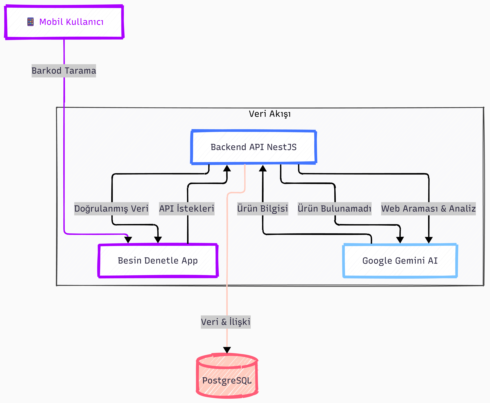

# Besin Denetle | Mobil App


**Besin Denetle**, tüketicilerin market alışverişlerinde ürünlerin içeriklerini, besin değerlerini ve sağlık üzerindeki etkilerini şeffaf bir şekilde görmelerini sağlayan, Yapay Zeka (AI) destekli modern bir mobil platformdur.

Bu proje, "Survival of the Fittest" (En Güçlünün Hayatta Kalması) prensibini benimser: Kullanıcı oylarıyla doğrulanan veriler hayatta kalır, hatalı bilgiler elenir.

## 📑 İçindekiler
- [Besin Denetle Mobil App](#besin-denetle-mobil-app)
  - [📑 İçindekiler](#-i̇çindekiler)
  - [🏗️ Sistem Mimarisi](#️-sistem-mimarisi)
    - [📂 Proje Yapısı (Monorepo)](#-proje-yapısı-monorepo)
  - [🚀 Hızlı Başlangıç](#-hızlı-başlangıç)
    - [Gereksinimler](#gereksinimler)
    - [Kurulum Adımları](#kurulum-adımları)
  - [🌍 Canlı Ortam (Production) Kurulumu](#-canlı-ortam-production-kurulumu)
  - [📚 Dokümantasyon](#-dokümantasyon)
    - [Geliştirme Rehberleri](#geliştirme-rehberleri)
    - [Deployment Rehberleri](#deployment-rehberleri)
  - [📄 Lisans](#-lisans)

---

## 🏗️ Sistem Mimarisi

Proje, güvenilirliği ve ölçeklenebilirliği artırmak için modern bir **Monorepo** yapısı üzerine kurulmuştur. Aşağıdaki diyagram, sistemin genel çalışma mantığını özetler:



### 📂 Proje Yapısı (Monorepo)

Bu proje **PNPM Workspaces** ile yönetilmektedir.

```text
Besin-Denetle/
├── apps/
│   ├── mobile/     # 📱 React Native (Expo) Uygulaması
│   └── backend/    # ⚙️ NestJS API Servisi
├── packages/
│   └── shared/     # 📦 Ortak DTO ve Tip Tanımları
├── docs/           # 📄 Proje Dokümantasyonu
├── docker-compose.yml  # 🐳 Veritabanı Konfigürasyonu
└── README.md       # 🏠 Ana Dokümantasyon
```

*   **`apps/mobile`**: React Native & Expo ile geliştirilmiş mobil uygulama (iOS/Android).
*   **`apps/backend`**: NestJS ile geliştirilmiş REST API servisi.
*   **`packages/shared`**: İki uygulama arasında paylaşılan DTO'lar, Tip Tanımları ve Utility fonksiyonları.

---

## 🚀 Hızlı Başlangıç

Projeyi yerel ortamınızda (Localhost) çalıştırmak için aşağıdaki adımları izleyin.

### Gereksinimler
*   Node.js (v20+)
*   PNPM (`npm install -g pnpm`)
*   Docker (Veritabanı için)

### Kurulum Adımları

1.  **Projeyi Klonlayın:**
    ```bash
    git clone https://github.com/Besin-Denetle-App/Besin-Denetle.git
    cd Besin-Denetle
    ```

2.  **Bağımlılıkları Yükleyin:**
    ```bash
    pnpm install
    ```

3.  **Veritabanını Başlatın:**
    Proje kök dizininde Docker Compose'u çalıştırın.
    ```bash
    docker compose up -d
    ```

4.  **Uygulamaları Başlatın:**
    
    **Backend:**
    ```bash
    # Root dizinde:
    pnpm dev:backend
    
    # veya apps/backend içinde:
    # pnpm start:dev
    ```
    
    **Mobile:**
    ```bash
    # Root dizinde:
    pnpm dev:mobile
    
    # veya apps/mobile içinde:
    # pnpm start
    ```

---

## 🌍 Canlı Ortam (Production) Kurulumu

Bu projeyi Ubuntu sunucuda yayına almak için hazır bir rehber bulunmaktadır:

👉 **[Server Deployment Rehberi](./docs/server-deployment.md)**

İçerik:
*   PostgreSQL Docker container'da çalışır
*   Backend PM2 ile yönetilir
*   Node.js ve PNPM kurulumu
*   Güvenlik ayarları (Firewall, SSL)
*   Yedekleme stratejileri

## 🗄️ Veritabanı İşlemleri (Root Kısayollar)

Projeyi geliştirirken veya sunucuda yönetirken aşağıdaki kısayolları kullanabilirsiniz:

| Komut | Açıklama |
|-------|----------|
| `pnpm db:migrate` | **Uygula:** Migrationları veritabanına işler (Tablo oluşturur/günceller). |
| `pnpm db:revert` | **Geri Al:** Son işlemi geri alır (Undo). |
| `pnpm db:show` | **Durum:** Hangi migrationların çalıştığını gösterir. |

---

## 📚 Dokümantasyon

### Geliştirme Rehberleri
*   ⚙️ **Backend API:** Veritabanı Şeması, AI ve API Endpoint'leri → [Backend README](./apps/backend/README.md)
*   📱 **Mobil Uygulama:** Ekranlar, Navigasyon ve Build işlemleri → [Mobile README](./apps/mobile/README.md)
*   📦 **Shared Kütüphane:** Ortak veri tipleri ve kullanım rehberi → [Shared README](./packages/shared/README.md)

### Deployment Rehberleri
*   🐳 **Docker Development:** Komutlar ve troubleshooting → [Docker Development Rehberi](./docs/docker-development.md)
*   🖥️ **Server Deployment:** Ubuntu'da sıfırdan kurulum → [Server Deployment Rehberi](./docs/server-deployment.md)
*   🔧 **Operasyon & Bakım:** Güncelleme, yedekleme ve bakım → [Operasyon Rehberi](./docs/server-operations-guide.md)
*   📱 **WSL2 Mobile Build:** EAS Local Build (Linux) → [Local Build - EAS (Linux/WSL2)](./docs/mobile-local-build-linux-eas.md)
*   🪟 **Windows Native Build:** Expo Prebuild (Windows) → [Local Build - Expo Prebuild (Windows)](./docs/mobile-local-build-windows-native.md)

## 📄 Lisans

