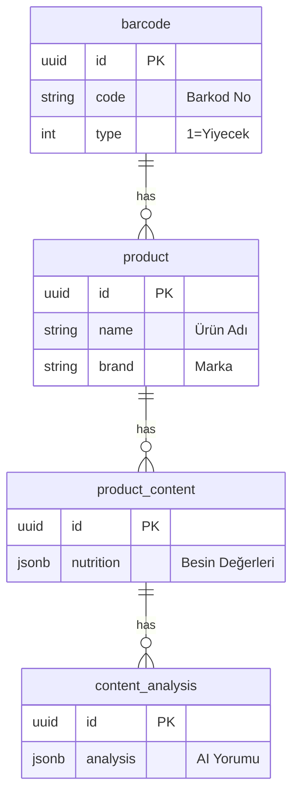

# Besin Denetle - Backend API

**Besin Denetle Backend**, projenin beynidir. Ürün verilerini yönetir, veritabanı işlemlerini gerçekleştirir ve Google Gemini AI servisi ile iletişim kurarak olmayan ürünleri analiz eder.

**NestJS (v11)** framework'ü ile geliştirilmiş, modüler ve mikroservis mimarisine uygun tasarlanmıştır.

## 📑 İçindekiler
- [Besin Denetle - Backend API](#besin-denetle---backend-api)
  - [📑 İçindekiler](#-i̇çindekiler)
  - [📂 Dosya Yapısı](#-dosya-yapısı)
  - [🏗️ Veritabanı Mimarisi](#️-veritabanı-mimarisi)
  - [🧠 Yapay Zeka (AI) Akışı](#-yapay-zeka-ai-akışı)
  - [⚙️ Kurulum ve Yapılandırma](#️-kurulum-ve-yapılandırma)
    - [1. Ortam Değişkenleri (.env)](#1-ortam-değişkenleri-env)
    - [2. Veritabanını Başlatma](#2-veritabanını-başlatma)
    - [3. Uygulamayı Başlatma](#3-uygulamayı-başlatma)
  - [🚀 Canlı Ortam (Production) Deployment](#-canlı-ortam-production-deployment)
    - [Build ve Çalıştırma](#build-ve-çalıştırma)
    - [Logları İzleme](#logları-i̇zleme)
  - [📡 API Endpointleri](#-api-endpointleri)
  - [🧪 Test](#-test)

---

## 📂 Dosya Yapısı

```text
apps/backend/src/
├── common/         # 🛠️ Interceptor, Filter ve Guard'lar
├── config/         # ⚙️ Env ve konfigürasyon dosyaları
├── entities/       # 🗄️ Veritabanı tablo modelleri (TypeORM)
├── modules/        # 📦 İş mantığı modülleri (Auth, Product, Vote...)
├── app.module.ts   # 🌳 Ana modül
└── main.ts         # 🚀 Uygulama giriş noktası
```

## 🏗️ Veritabanı Mimarisi

Sistem, ilişkisel bütünlüğü (referential integrity) koruyan 6 ana PostgreSQL tablosundan oluşur.



*   **Barcode:** Sisteme giren her barkod tekildir (Unique).
*   **Varyant Sistemi:** AI farklı zamanlarda farklı sonuçlar üretebileceği için, her barkodun altında birden fazla `Product` (Varyant) olabilir. Kullanıcılar oylamalarla en doğru varyantı seçer.

---

## 🧠 Yapay Zeka (AI) Akışı

Google Gemini API (Search Grounding özellikli) kullanılarak 3 aşamalı bir analiz yapılır. Bu akış maliyeti optimize eder ve hızı artırır.

1.  **Kimlik Tespiti (Identity):** Barkod taranır, sadece marka ve ürün adı bulunur. (Hızlı yanıt için)
2.  **İçerik Analizi (Content):** Kullanıcı ürünü onaylarsa, içindekiler ve besin değerleri araştırılır. (OCR/Web Search)
3.  **Sağlık Yorumu (Analysis):** Bulunan içerikler beslenme uzmanı rolüyle analiz edilir ve sağlık puanı verilir.

---

## ⚙️ Kurulum ve Yapılandırma

Backend'i çalıştırmak için `.env` dosyasını oluşturmanız **zorunludur**.

### 1. Ortam Değişkenleri (.env)

`apps/backend` klasöründe `.env` dosyasını oluşturun:

```env
# --- SUNUCU AYARLARI ---
PORT=3200
NODE_ENV=development

# --- VERİTABANI ---
# Docker Compose varsayılan ayarlarıdır
DB_HOST=localhost
DB_PORT=5432
DB_USER=myuser
DB_PASSWORD=mypassword
DB_NAME=besindenetle

# --- GÜVENLİK ---
# JWT token üretimi için güçlü bir şifre belirleyin
JWT_SECRET=super-gizli-anahtar-buraya

# --- GOOGLE AI (Opsiyonel) ---
# Boş bırakılırsa Mock Servis çalışır (Ücret yazmaz)
GEMINI_API_KEY=google-ai-studio-key-buraya
```

### 2. Veritabanını Başlatma

Ana dizindeki Docker Compose dosyasını kullanın:

```bash
docker compose up -d
```

### 3. Uygulamayı Başlatma

```bash
# Geliştirme modu (Hot reload aktif)
pnpm dev
```

---

## 🚀 Canlı Ortam (Production) Deployment

Uygulamayı Ubuntu sunucuda yayına almak için aşağıdaki adımları izleyin.

### Build ve Çalıştırma

TypeScript kodlarını JavaScript'e derlemeniz gerekir. **Önemli:** Backend, Shared paketine bağımlı olduğu için önce shared derlenmelidir.

```bash
# 1. Bağımlılıkları yükleyin
pnpm install

# 2. Önce Shared kütüphanesini derleyin
pnpm --filter @besin-denetle/shared build

# 3. Backend uygulamasını derleyin
pnpm build

# 4. PM2 ile servisi başlatın
pm2 start dist/main.js --name "besin-backend"
```

### Logları İzleme
```bash
pm2 logs besin-backend
```

---

## 📡 API Endpointleri

Uygulama çalıştığında Swagger dokümantasyonuna erişebilirsiniz:
👉 **URL:** `http://localhost:3200/api/docs`

| Metot | Endpoint | Açıklama |
| :--- | :--- | :--- |
| `POST` | `/auth/oauth` | Google/Apple ile giriş yap |
| `POST` | `/products/scan` | Barkod tara (AI tetikler) |
| `POST` | `/products/confirm` | Ürünü onaylayıp içeriği getir |
| `POST` | `/vote` | Bir veriye UP/DOWN oy ver |

---

## 🧪 Test

Birim ve entegrasyon testlerini çalıştırmak için:

```bash
# Birim testleri
pnpm test

# Test coverage raporu
pnpm test:cov
```
