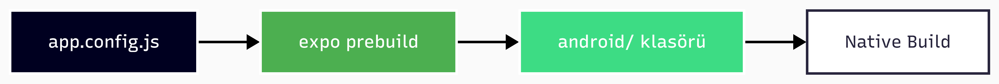

# 🪟 Windows Native Build Rehberi


Bu rehber, **Windows** üzerinde **doğrudan native Android build** almak için adım adım talimatlar içerir.

## 📊 Build Yöntemleri Karşılaştırması

| Özellik                  | EAS Cloud Build | WSL2 Local     | **Windows Native** |
| ------------------------ | --------------- | -------------- | ------------------ |
| **Kurulum**              | ✅ Kolay         | ⚠️ Orta         | ⚠️ Orta             |
| **İlk Build Süresi**     | ~15-20 dk       | ~10-15 dk      | ~10-15 dk          |
| **Sonraki Build**        | ~10-15 dk       | ~5-10 dk       | ~5-10 dk           |
| **Maliyet**              | 💰 Ücretli       | ✅ Ücretsiz     | ✅ Ücretsiz         |
| **İnternet Gereksinimi** | ☁️ Gerekli       | 🌐 İsteğe bağlı | 🌐 İsteğe bağlı     |
| **Disk Kullanımı**       | ✅ Yok           | 📦 ~15 GB       | 📦 ~10 GB           |
| **Platform**             | ✅ Hepsi         | 🐧 Linux        | 🪟 Windows          |
| **Credentials Kontrolü** | ☁️ Cloud         | 🔑 Lokal        | 🔑 Lokal            |

**Alternatif Rehberler:**
- 📦 [EAS Cloud Build](../apps/mobile/README.md) - En kolay yöntem
- 🐧 [WSL2 ile EAS Local Build](./wsl2-mobile-build-guide.md) - Linux environment

---

## 📋 Sistem Gereksinimleri

| Bileşen            | Versiyon       | Neden Gerekli             | Disk Alanı |
| ------------------ | -------------- | ------------------------- | ---------- |
| **Windows**        | 10/11 (64-bit) | İşletim sistemi           | -          |
| **Node.js**        | 20.x LTS       | JavaScript runtime        | ~500 MB    |
| **pnpm**           | 9.x            | Monorepo paket yöneticisi | ~50 MB     |
| **Java JDK**       | 17             | Android Gradle build      | ~300 MB    |
| **Android Studio** | Latest         | SDK ve build araçları     | ~8-10 GB   |

> [!NOTE]
> **Toplam Disk Alanı:** ~10-12 GB
> **Tahmini Kurulum Süresi:** 45-60 dakika (indirme hızına bağlı)

---

## 🚀 Adım Adım Kurulum

### 1️⃣ Java JDK 17 Kurulumu

Android build için Java Development Kit gereklidir.

#### İndirme ve Kurulum

1. [**Adoptium OpenJDK 17**](https://adoptium.net/) adresine gidin
2. **Temurin 17 (LTS)** - Windows x64 MSI dosyasını indirin
3. Kurulum sırasında **"Set JAVA_HOME variable"** seçeneğini işaretleyin
4. Kurulumu tamamlayın

#### Ortam Değişkenlerini Manuel Ayarlama

Eğer kurulum JAVA_HOME'u ayarlamadıysa:

```powershell
# PowerShell'i Administrator olarak açın
# System Properties açmak için
rundll32 sysdm.cpl,EditEnvironmentVariables
```

**Environment Variables** penceresinde:

1. **System variables** altında **New** tıklayın:
   ```
   Variable name: JAVA_HOME
   Variable value: C:\Program Files\Eclipse Adoptium\jdk-17.0.x-hotspot
   ```

2. **Path** değişkenini düzenleyin ve ekleyin:
   ```
   %JAVA_HOME%\bin
   ```

#### Doğrulama

Yeni bir PowerShell penceresi açın ve test edin:

```powershell
java -version
# openjdk version "17.0.x" 2024-xx-xx
# OpenJDK Runtime Environment Temurin-17.0.x

javac -version
# javac 17.0.x
```

> [!WARNING]
> Eğer `java -version` başarısız oluyorsa, PowerShell penceresini kapatıp yeni bir pencere açın. Ortam değişkenleri güncellemeleri yeni terminallerde geçerli olur.

---

### 2️⃣ Android Studio ve SDK Kurulumu

Android SDK ve build araçları için Android Studio gereklidir.

#### Android Studio Kurulumu

1. [**Android Studio**](https://developer.android.com/studio) indirin
2. Kurulumu başlatın ve **Standard** kurulum tipini seçin
3. Kurulum sırasında şunlar otomatik yüklenecek:
   - Android SDK
   - Android SDK Platform
   - Android Virtual Device (AVD)

#### SDK Manager Yapılandırması

Android Studio'yu açıp SDK Manager'a gidin:
- **Tools → SDK Manager** veya **Welcome Screen → More Actions → SDK Manager**

> [!IMPORTANT]
> **Önemli:** "Show Package Details" kutusunu işaretleyin, aksi halde alt paketleri göremezsiniz!

---

##### 📋 SDK Platforms Sekmesi Checklist

| Yüklenecek Paket                      | Gereklilik | Açıklama         |
| ------------------------------------- | ---------- | ---------------- |
| ☐ **Android 14.0 ("UpsideDownCake")** | ✅ Zorunlu  | Ana SDK Platform |

**"Show Package Details" işaretli iken Android 14.0 altında:**

| Alt Paket                                    | Gereklilik  | Açıklama                   |
| -------------------------------------------- | ----------- | -------------------------- |
| ☐ Android SDK Platform 34                    | ✅ Zorunlu   | Build için gerekli         |
| ☐ Sources for Android 34                     | ⚪ Opsiyonel | Kaynak kodu debugging için |
| ☐ Google APIs Intel x86_64 Atom System Image | ⚪ Opsiyonel | Emulator için (Intel CPU)  |
| ☐ Google Play Intel x86_64 Atom System Image | ⚪ Opsiyonel | Play Services ile emulator |

---

##### 📋 SDK Tools Sekmesi Checklist

| Yüklenecek Paket                              | Gereklilik  | Açıklama                                |
| --------------------------------------------- | ----------- | --------------------------------------- |
| ☐ **Android SDK Build-Tools 34.0.0**          | ✅ Zorunlu   | Derleme araçları                        |
| ☐ **Android SDK Command-line Tools (latest)** | ✅ Zorunlu   | `sdkmanager`, `avdmanager` komutları    |
| ☐ **Android SDK Platform-Tools**              | ✅ Zorunlu   | `adb` komutu                            |
| ☐ **CMake**                                   | ✅ Zorunlu   | Native C++ build için (Reanimated, vb.) |
| ☐ **NDK (Side by side)**                      | ✅ Zorunlu   | Native Development Kit                  |
| ☐ Android Emulator                            | ⚪ Opsiyonel | Sanal cihaz testi için                  |
| ☐ Google Play Services                        | ⚪ Opsiyonel | Google APIs için                        |

> [!WARNING]
> **CMake ve NDK zorunludur!** Bu paketler olmadan `react-native-reanimated`, `react-native-worklets` gibi native modüller derlenemez.

---

##### 🔧 SDK Tools'ta NDK ve CMake Versiyonları

**"Show Package Details" işaretli iken:**

**NDK (Side by side)** altında:
| Versiyon                      | Gereklilik |
| ----------------------------- | ---------- |
| ☐ 27.1.12297006 (veya en son) | ✅ Önerilen |

**CMake** altında:
| Versiyon              | Gereklilik |
| --------------------- | ---------- |
| ☐ 4.1.2 (veya en son) | ✅ Önerilen |

> [!NOTE]
> En son kararlı sürümleri yükleyebilirsiniz. Expo ve React Native genellikle en güncel NDK/CMake sürümleriyle uyumludur.

#### Android SDK Ortam Değişkenleri

```powershell
# PowerShell'i Administrator olarak açın
rundll32 sysdm.cpl,EditEnvironmentVariables
```

**System variables** altında:

1. **ANDROID_HOME** oluşturun:
   ```
   Variable name: ANDROID_HOME
   Variable value: C:\Users\<kullanici>\AppData\Local\Android\Sdk
   ```
   
   > [!NOTE]
   > `<kullanici>` yerine Windows kullanıcı adınızı yazın.

2. **Path** değişkenini düzenleyin ve ekleyin:
   ```
   %ANDROID_HOME%\platform-tools
   %ANDROID_HOME%\emulator
   %ANDROID_HOME%\tools
   %ANDROID_HOME%\tools\bin
   ```

#### Doğrulama

Yeni bir PowerShell penceresi açın:

```powershell
# Android Debug Bridge
adb --version
# Android Debug Bridge version 1.0.41

# SDK Manager
sdkmanager --version
# x.x.x (versiyonu gösterir)

# Platform tools
avdmanager list avd
# (Kurulu emülatörleri listeler, boş olabilir)
```

> [!IMPORTANT]
> Eğer komutlar çalışmıyorsa:
> 1. PowerShell penceresini kapatıp yeniden açın
> 2. ANDROID_HOME yolunu kontrol edin: `echo $env:ANDROID_HOME`

---

### 3️⃣ Node.js ve pnpm Kurulumu

Proje monorepo yapısında olduğu için **pnpm** kullanıyoruz.

#### Node.js Kurulumu

1. [**Node.js 20 LTS**](https://nodejs.org/) indirin (önerilen: 20.x.x)
2. Windows Installer (.msi) dosyasını çalıştırın
3. Kurulum sırasında **"Automatically install necessary tools"** seçeneğini atlayabilirsiniz

#### pnpm Kurulumu

```powershell
# npm ile pnpm'i global olarak kur
npm install -g pnpm
# Doğrulama
node -v
# v20.x.x
npm -v
# 10.x.x
pnpm -v
# 9.x.x
```

---

## 📱 Build Alma Süreci

### Workflow Diyagramı


---

#### 📋 Kapsamlı Env Kaynağı Tablosu

```
┌─────────────────┬─────────────────┬────────────────────────────┐
│ Senaryo         │ Env Kaynağı     │ API Değişkenleri           │
├─────────────────┼─────────────────┼────────────────────────────┤
│ expo start      │ .env dosyası    │ DEV_API_HOST:DEV_API_PORT  │
│ local preview   │ eas.json        │ API_HOST:API_PORT          │
│ local prod      │ eas.json        │ API_URL                    │
│ cloud preview   │ eas.json        │ API_HOST:API_PORT          │
│ cloud prod      │ EAS Secrets     │ API_URL                    │
└─────────────────┴─────────────────┴────────────────────────────┘
```

> [!IMPORTANT]
> **Local build için:** `.env` dosyası OKUNMAZ! Değişkenler `eas.json`'dan gelir.

**eas.json env bloğu örneği:**

```json
{
  "build": {
    "preview": {
      "env": {
        "APP_ENV": "preview",
        "API_HOST": "192.168.1.100",
        "API_PORT": "3200"
      }
    }
  }
}
```

---

### 3️⃣ Native Proje Oluşturma (Expo Prebuild)

Expo'nun **CNG (Continuous Native Generation)** yaklaşımı kullanılır.

#### CNG Yaklaşımı Nedir?



> [!IMPORTANT]
> **CNG Felsefesi:**
> - ❌ `android/` klasörü **Git'e eklenmeyecek**
> - ✅ Her build'de `prebuild` ile **yeniden oluşturuyoruz**
> - ✅ `app.config.js` tek gerçek kaynak (single source of truth)
> - ✅ Her zaman **temiz ve güncel** native kod

#### Prebuild Komutu

```powershell
# apps/mobile dizininde
npx expo prebuild --platform android

# Veya mevcut android/ klasörünü temizleyip yeniden oluştur
npx expo prebuild --platform android --clean
```

**Çıktı:**
```
✔ Created native Android project | android/
✔ Updated package.json
✔ Config synced
```

> [!TIP]
> **Ne Zaman `--clean` Kullanmalı?**
> - 🔧 `app.config.js` değiştiğinde
> - 📦 Native plugin eklendiğinde/çıkarıldığında
> - ⚠️ Gradle hataları alındığında
> - 🔄 Build sorunları yaşandığında

#### Prebuild Sonrası Oluşturulanlar

```
apps/mobile/
├── android/                    # ✅ YENİ OLUŞTURULDU
│   ├── app/
│   │   ├── build.gradle       # Build konfigürasyonu
│   │   └── src/
│   ├── gradle/
│   ├── build.gradle           # Proje seviyesi build
│   ├── settings.gradle
│   └── gradlew.bat            # Gradle wrapper
├── .env                        # Environment değişkenler
└── app.config.js               # Expo konfigürasyonu
```

---

### 4️⃣ Debug APK Oluşturma (Geliştirme)

Debug build imza gerektirmez, hızlıdır ve geliştirme için uygundur.

#### Yöntem 1: Expo CLI (Önerilen)

```powershell
# Build ve direkt cihaza yükle (cihaz/emulator bağlı olmalı)
npx expo run:android --variant debug

# Veya sadece build al (yine cihaz gerektirir)
npx expo run:android --variant debug --no-install
```

> [!TIP]
> **Cihaz Bağlamadan APK Almak İstiyorsanız:**
> 
> `eas build --local` komutu **Windows'ta desteklenmez** (macOS/Linux gerektirir).
> Linux/WSL ortamında EAS Local Build kullanmak için: [WSL2 ile EAS Local Build](./local-build-linux-eas.md) 
> Windows'ta cihaz bağlamadan APK almak için **Gradle** kullanın:

#### Yöntem 2: Gradle (Direkt)

```powershell
# android/ klasörüne git
cd android

# Debug APK oluştur
.\gradlew assembleDebug

# Çıktı: android\app\build\outputs\apk\debug\app-debug.apk
```

> [!NOTE]
> **İlk build ne kadar sürer?**
> - ⏱️ İlk build: ~10-15 dakika (Gradle bağımlılıkları indirilir)
> - ⚡ Sonraki build'ler: ~2-5 dakika (cache kullanılır)

#### APK'yı Cihaza Yükleme

```powershell
# Cihazı kontrol et
adb devices
# List of devices attached
# ABC123XYZ       device

# APK'yı yükle
adb install android\app\build\outputs\apk\debug\app-debug.apk

# Veya mevcut uygulamayı güncelle
adb install -r android\app\build\outputs\apk\debug\app-debug.apk
```

---

### 5️⃣ Release APK/AAB Oluşturma (Dağıtım)

Release build için **keystore** ile imzalama gereklidir.

> [!CAUTION]
> **Keystore Güvenliği:**
> - 🔑 Keystore dosyası **asla Git'e eklenmemeli**
> - 💾 Güvenli bir yerde **yedeklenmeli** (bulut + lokal)
> - 🔐 Şifreler **güçlü ve farklı** olmalı
> - ⚠️ Keystore kaybedilirse **Play Store güncellemeleri imkansız** olur

---

#### Seçenek A: EAS Cloud'dan Keystore İndirme

EAS Build kullanıyorsanız ve mevcut keystore'u kullanmak istiyorsanız:

##### 1. Credentials Menu ile İndirme

```powershell
# apps/mobile dizininde
eas credentials

# Veya direkt Android credentials'a git
eas credentials --platform android
```

**Menü Navigasyonu:**
```
? Select platform › android
? What do you want to do? › Download credentials
? App: Besin-Denetle (@furkanpasa/Besin-Denetle)
? Select build credentials › Production (default)
? What credentials do you want to download? › All: Download everything
```

**İndirilen Dosyalar:**
- `credentials.json` - Keystore metadata ve şifreler
- `upload-keystore.jks` - Keystore dosyası

> [!IMPORTANT]
> - `credentials.json` dosyasını `.gitignore`'a ekleyin
> - Şifreleri `gradle.properties` dosyasında kullanacaksınız

---

#### Seçenek B: Yeni Keystore Oluşturma

Eğer daha önce keystore oluşturmadıysanız:

```powershell
# apps/mobile dizininde
keytool -genkeypair -v -storetype PKCS12 `
  -keystore upload-keystore.jks `
  -alias upload-key `
  -keyalg RSA `
  -keysize 2048 `
  -validity 10000

# Sorulacaklar:
# - Keystore password: ******** (güçlü bir şifre)
# - Key password: ******** (aynı veya farklı şifre)
# - İsim, organizasyon, şehir vb. (bilgileriniz)
```

**Oluşturulan dosya:** `apps/mobile/upload-keystore.jks`

> [!WARNING]
> Bu dosyayı mutlaka güvenli bir yere yedekleyin!

---

#### Gradle Signing Konfigürasyonu

##### 1. Keystore'u Kopyalama

```powershell
# Keystore'u android/app/ klasörüne kopyala
copy upload-keystore.jks android\app\upload-keystore.jks
```

##### 2. `gradle.properties` Dosyası

`android/gradle.properties` dosyasını düzenleyin veya oluşturun:

```properties
# ============================================
# Android Keystore Configuration
# ============================================

# Keystore dosyası (android/app/ dizinine göre relative)
MYAPP_UPLOAD_STORE_FILE=upload-keystore.jks

# Keystore alias:
# - EAS'tan indirdiyseniz: key0 (EAS varsayılanı)
# - Kendiniz oluşturduysanız: upload-key (veya belirlediğiniz alias)
MYAPP_UPLOAD_KEY_ALIAS=key0

# Keystore şifresi:
# - EAS'tan: credentials.json dosyasındaki "keystorePassword" değeri
# - Manuel: keystore oluştururken girdiğiniz şifre
MYAPP_UPLOAD_STORE_PASSWORD=super_secret_password_123

# Key şifresi:
# - EAS'tan: credentials.json dosyasındaki "keyPassword" değeri
# - Manuel: keystore oluştururken girdiğiniz key şifresi (genellikle keystore ile aynı)
MYAPP_UPLOAD_KEY_PASSWORD=super_secret_password_123
```

> [!TIP]
> **Hangi değerleri kullanmalıyım?**
> | Kaynak | Alias | Şifre Kaynağı |
> |--------|-------|---------------|
> | **Seçenek A (EAS)** | `key0` | `credentials.json` dosyası |
> | **Seçenek B (Manuel)** | `upload-key` | Oluştururken girdiğiniz şifre |

> [!CAUTION]
> **Güvenlik Notları:**
> - ❌ Bu dosya `.gitignore`'a eklenmiş olmalı
> - ❌ Şifreleri Git'e asla commit etmeyin

##### 3. `build.gradle` Signing Config

`android/app/build.gradle` dosyasını düzenleyin:

```gradle
android {
    // ... mevcut konfigürasyon

    signingConfigs {
        release {
            // gradle.properties dosyasından oku
            if (project.hasProperty('MYAPP_UPLOAD_STORE_FILE')) {
                storeFile file(MYAPP_UPLOAD_STORE_FILE)
                storePassword MYAPP_UPLOAD_STORE_PASSWORD
                keyAlias MYAPP_UPLOAD_KEY_ALIAS
                keyPassword MYAPP_UPLOAD_KEY_PASSWORD
            }
        }
    }

    buildTypes {
        release {
            signingConfig signingConfigs.release
            minifyEnabled true
            proguardFiles getDefaultProguardFile('proguard-android-optimize.txt'), 'proguard-rules.pro'
        }
    }
}
```

> [!NOTE]
> **Expo prebuild zaten bu ayarları yapar!**
> Prebuild ile oluşturulan `build.gradle` dosyası zaten signing config içerir. Sadece `gradle.properties` dosyasını düzenlemeniz yeterli olabilir.

---

> - ⚠️ Keystore kaybedilirse **Play Store güncellemeleri imkansız** olur

---

### 6. Local Keystore Kurulumu (EAS CLI ile)

Google Login gibi servislerin çalışması için uygulamanın **Production Keystore** ile imzalanması şarttır.

1.  **Keystore'u İndir:**
    ```powershell
    cd apps/mobile
    eas credentials
    # Android > Production > Download Keystore yolunu izleyin
    ```

2.  **Dosyayı Yerleştir:**
    İndirdiğiniz `.jks` dosyasını `apps/mobile/.credentials/` klasörüne taşıyın.

3.  **credentials.json Ayarla:**
    `apps/mobile` dizininde `credentials.json` oluşturun:
    ```json
    {
      "android": {
        "keystore": {
          "keystorePath": "./.credentials/DOSYA_ADINIZ.jks",
          "keystorePassword": "ŞİFRENİZ",
          "keyAlias": "ALIAS_ADINIZ",
          "keyPassword": "KEY_ŞİFRENİZ"
        }
      }
    }
    ```

---

#### Release Build Komutları

##### APK Oluşturma (Direkt Kurulum)

```powershell
cd android
.\gradlew assembleRelease

# Çıktı: android\app\build\outputs\apk\release\app-release.apk
```

**APK Özellikleri:**
- 📦 Boyut: ~30-50 MB (universal APK)
- 📱 Kullanım: Direkt cihaza kurulum, testing
- ❌ Play Store için önerilmez (AAB kullanın)

##### AAB Oluşturma (Play Store)

```powershell
cd android
.\gradlew bundleRelease

# Çıktı: android\app\build\outputs\bundle\release\app-release.aab
```

**AAB Özellikleri:**
- 📦 Boyut: ~25-40 MB (base bundle)
- 📱 Kullanım: Play Store yayını (önerilen)
- ✅ Play Store otomatik optimize eder (APK splits)
- 🌍 Her cihaza özel APK sunar (daha küçük indirme)

> [!TIP]
> **APK vs AAB Ne Zaman?**
> - **APK:** Beta test, direkt dağıtım, hızlı test
> - **AAB:** Play Store yayını, production release

---

#### Build Çıktılarını Test Etme

##### APK Test

```powershell
# APK'yı cihaza yükle
adb install android\app\build\outputs\apk\release\app-release.apk

# Uygulamayı başlat
adb shell am start -n app.besindenetle.android/.MainActivity
```

##### AAB Test (bundletool ile)

```powershell
# bundletool indir (ilk kez)
# https://github.com/google/bundletool/releases

# AAB'den evrensel APK oluştur
java -jar bundletool.jar build-apks `
  --bundle=android\app\build\outputs\bundle\release\app-release.aab `
  --output=app.apks `
  --mode=universal `
  --ks=upload-keystore.jks `
  --ks-key-alias=key0

# APKs içinden APK çıkar
unzip app.apks -d apks

# Universal APK'yı kur
adb install apks\universal.apk
```

---

## 🔧 Troubleshooting

### Yaygın Hatalar ve Çözümleri

#### 1. CMake Path Length Exceeded (Dosya Yolu Çok Uzun)

**Hata:**
```
CMake Warning: The object file directory has 215 characters.
The maximum full path to an object file is 250 characters.
Object file cannot be safely placed under this directory.
```

**Neden:** Windows'ta pnpm'in `.pnpm` klasör yapısı çok uzun yollar oluşturur ve CMake'in 250 karakter sınırını aşar.

**Çözüm A: Projeyi Kısa Yola Taşı (Önerilen)**

```powershell
# Projeyi kısa bir yola klonla
cd C:\
mkdir dev
git clone <repo-url> dev\BD
cd dev\BD
pnpm install
```

> [!TIP]
> `C:\dev\BD` gibi kısa bir yol kullanmak en güvenilir çözümdür.

**Çözüm B: Windows Uzun Yol Desteğini Aktif Et**

```powershell
# PowerShell'i Administrator olarak açın
New-ItemProperty -Path "HKLM:\SYSTEM\CurrentControlSet\Control\FileSystem" -Name "LongPathsEnabled" -Value 1 -PropertyType DWORD -Force

# Bilgisayarı yeniden başlatın
```

---

#### 2. SDK Location Not Found

**Hata:**
```
SDK location not found. Define location with an ANDROID_HOME environment variable
or by setting the sdk.dir path in your project's local properties file
```

**Çözüm:**

```powershell
# android/local.properties dosyası oluşturun
echo "sdk.dir=C:\\Users\\<kullanici>\\AppData\\Local\\Android\\Sdk" > android\local.properties

# Veya ANDROID_HOME'u kontrol edin
echo $env:ANDROID_HOME
```

---

#### 3. JAVA_HOME is Not Set

**Hata:**
```
ERROR: JAVA_HOME is not set and no 'java' command could be found in your PATH
```

**Çözüm:**

```powershell
# JAVA_HOME kontrol
echo $env:JAVA_HOME
# Boşsa veya yanlışsa:

# System Properties aç ve Environment Variables düzenle
rundll32 sysdm.cpl,EditEnvironmentVariables

# Veya PowerShell ile set et (geçici)
$env:JAVA_HOME = "C:\Program Files\Eclipse Adoptium\jdk-17.0.x-hotspot"
```

---

#### 4. Gradle Sync Failed

**Hata:**
```
* What went wrong:
Could not resolve all dependencies for configuration ':app:releaseRuntimeClasspath'
```

**Çözüm:**

```powershell
# Cache temizle
cd android
.\gradlew clean

# Dependency cache'i yenile
.\gradlew --refresh-dependencies

# Node modules'u temizle (gerekirse)
cd ..
rm -r node_modules
pnpm install
```

---

#### 5. Keystore Password Yanlış

**Hata:**
```
Execution failed for task ':app:packageRelease'.
> A failure occurred while executing com.android.build.gradle.internal.tasks.Workers$ActionFacade
   > Keystore was tampered with, or password was incorrect
```

**Çözüm:**

```powershell
# gradle.properties dosyasındaki şifreleri kontrol edin
# credentials.json ile karşılaştırın

# Keystore'u test edin
keytool -list -v -keystore android\app\upload-keystore.jks
# Şifre soracak, doğru şifreyi girin
```

---

#### 6. Out of Memory (OOM)

**Hata:**
```
Expiring Daemon because JVM heap space is exhausted
```

**Çözüm:**

`android/gradle.properties` dosyasına ekleyin:

```properties
# Gradle heap size artır
org.gradle.jvmargs=-Xmx4096m -XX:MaxMetaspaceSize=512m -XX:+HeapDumpOnOutOfMemoryError

# Paralel build
org.gradle.parallel=true
```

---

---

#### 7. Android Emulator Bulunamıyor

**Hata:**
```
No emulators found as an output of `emulator -list-avds`
```

**Çözüm:**

```powershell
# Emulator listesini kontrol et
$env:ANDROID_HOME\emulator\emulator.exe -list-avds

# Boşsa Android Studio'dan AVD oluştur
# Tools → Device Manager → Create Virtual Device

# Veya komut satırından
avdmanager create avd -n Pixel_5_API_34 -k "system-images;android-34;google_apis;x86_64"
```

---

#### 8. Metro Bundler Port Conflict

**Hata:**
```
Error: listen EADDRINUSE: address already in use :::8081
```

**Çözüm:**

```powershell
# Metro bundler'ı farklı portta çalıştır
npx expo start --port 8088

# Veya çakışan process'i kapat
netstat -ano | findstr :8081
# PID bulun ve sonlandırın
taskkill /PID <PID> /F
```

---

## ❓ Sıkça Sorulan Sorular (SSS)

### Build Süreci

<details>
<summary><strong>Q: İlk build ne kadar sürer?</strong></summary>

**A:** 
- ⏱️ **İlk prebuild:** ~2-3 dakika
- ⏱️ **İlk Gradle build:** ~10-15 dakika (bağımlılıklar indirilir)
- ⏱️ **Sonraki build'ler:** ~2-5 dakika (cache sayesinde)

Build süresini etkileyen faktörler:
- CPU hızı
- RAM miktarı (min 8 GB önerilir)
- SSD vs HDD (SSD 2-3x daha hızlı)
- İnternet hızı (ilk build için)
</details>

<details>
<summary><strong>Q: Her code değişikliğinde prebuild yapmam gerekir mi?</strong></summary>

**A:** Hayır! Sadece şu durumlarda prebuild yapın:
- ✅ `app.config.js` değiştiğinde
- ✅ Native plugin eklediğinizde/çıkardığınızda (örn: expo-camera)
- ✅ Android permissions değiştiğinde
- ❌ Normal JS/TS kod değişiklikleri için **gereksiz**

Metro bundler (expo start) JS değişikliklerini otomatik yükler.
</details>

<details>
<summary><strong>Q: APK vs AAB hangisini kullanmalıyım?</strong></summary>

**A:**
- **APK:** 
  - ✅ Direkt kurulum
  - ✅ Beta test
  - ✅ Hızlı iterasyon
  - ❌ Play Store için önerilmez
  
- **AAB:**
  - ✅ Play Store yayını (required)
  - ✅ Optimize edilmiş boyut
  - ✅ Her cihaza özel APK
  - ❌ Direkt kurulamaz (bundletool gerekir)
</details>

---

### Keystore Yönetimi

<details>
<summary><strong>Q: Keystore dosyasını kaybedersem ne olur?</strong></summary>

**A:** ⚠️ **Kritik Durum!**
- ❌ Play Store'daki mevcut uygulamayı **güncelleyemezsiniz**
- ❌ Yeni bir uygulama olarak yayınlamanız gerekir (yeni package name)
- ❌ Tüm kullanıcılar, yorumlar, derecelendirmeler kaybolur

**Çözüm: Backup!**
- ✅ Keystore'u güvenli yere yedekleyin (cloud + lokal)
- ✅ Şifreleri güvenli bir password manager'da saklayın
- ✅ EAS Build kullanıyorsanız, keystore zaten cloud'da
</details>

<details>
<summary><strong>Q: Keystore şifremi unuttum, ne yapabilirim?</strong></summary>

**A:** 😞 **Maalesef şifre kurtarma yok**
- Keystore şifresi kurtarılamaz
- Android keystore teknolojisi şifre sıfırlamayı desteklemez
- Tek çözüm: Yeni keystore oluşturmak (yeni app paketi)

**Önlem:**
- Password manager kullanın (Bitwarden, 1Password, LastPass)
- `credentials.json` dosyasını güvenli bir yerde saklayın
</details>

<details>
<summary><strong>Q: Keystore'u Git'e eklemeli miyim?</strong></summary>

**A:** ❌ **KATİYEN HAYIR!**

`.gitignore` dosyasında olmalı:
```gitignore
# Keystore files
*.jks
*.keystore
upload-keystore.jks

# Credentials
credentials.json
gradle.properties
local.properties
```

Keystore'u Git'e eklemek **güvenlik riski** oluşturur.
</details>

---

### Geliştirme Workflow

<details>
<summary><strong>Q: Git'te android/ klasörünü tutmalı mıyım?</strong></summary>

**A:** ❌ **Hayır (Expo CNG yaklaşımı)**

`.gitignore`:
```gitignore
# Native folders (generated by expo prebuild)
android/
ios/
```

**Neden?**
- ✅ `app.config.js` zaten tüm konfigürasyonu içerir
- ✅ `expo prebuild` ile her zaman yeniden oluşturulabilir
- ✅ Merge conflict'lerini önler
- ✅ Repo boyutunu küçültür

**İstisnalar:**
- Eğer native kod yazdıysanız (custom modules)
- Expo prebuild kullanmıyorsanız
</details>

<details>
<summary><strong>Q: Build boyutunu nasıl küçültebilirim?</strong></summary>

**A:** 

1. **Enable ProGuard (minification):**
   ```gradle
   // android/app/build.gradle
   buildTypes {
       release {
           minifyEnabled true
           shrinkResources true
       }
   }
   ```

2. **ABI split APK'lar:**
   ```gradle
   android {
       splits {
           abi {
               enable true
               reset()
               include 'armeabi-v7a', 'arm64-v8a'
           }
       }
   }
   ```

3. **Asset optimizasyonu:**
   - Görselleri WebP formatına çevirin
   - Kullanılmayan fontları kaldırın

4. **AAB kullanın:**
   - Play Store otomatik optimize eder
   - Her cihaz sadece ihtiyacı olan APK'yı indirir
</details>

<details>
<summary><strong>Q: Windows Defender build'i yavaşlatır mı?</strong></summary>

**A:** ✅ **Evet, önemli ölçüde!**

**Çözüm:** Build klasörlerini Windows Defender'dan exclude edin:

1. **Windows Security** → **Virus & threat protection**
2. **Manage settings** → **Exclusions** → **Add or remove exclusions**
3. Şu klasörleri ekleyin:
   ```
   C:\Users\<kullanici>\GitHub\Besin-Denetle
   C:\Users\<kullanici>\AppData\Local\Android\Sdk
   C:\Users\<kullanici>\.gradle
   ```
</details>

---

## 📊 Build Optimizasyon İpuçları

### Windows Specific Tips

```powershell
# Windows Defender exclusions (Admin PowerShell)
Add-MpPreference -ExclusionPath "C:\Users\<kullanici>\GitHub\Besin-Denetle"
Add-MpPreference -ExclusionPath "C:\Users\<kullanici>\AppData\Local\Android\Sdk"
Add-MpPreference -ExclusionPath "C:\Users\<kullanici>\.gradle"

# Gradle cache temizleme (ayda bir)
cd android
.\gradlew cleanBuildCache

# Global Gradle cache (~/.gradle/caches)
rm -r $env:USERPROFILE\.gradle\caches
```

---

## 📚 Faydalı Komutlar Referansı

### Expo Komutları

| Komut                       | Açıklama              | Kullanım                         |
| --------------------------- | --------------------- | -------------------------------- |
| `npx expo prebuild`         | Native proje oluştur  | İlk kez veya config değiştiğinde |
| `npx expo prebuild --clean` | Temiz prebuild        | Native sorunları çözmek için     |
| `npx expo run:android`      | Debug build + run     | Geliştirme sırasında             |
| `npx expo start`            | Metro bundler başlat  | JS development                   |
| `npx expo start --clear`    | Cache temizle + start | Cache sorunlarında               |

### Gradle Komutları

| Komut                              | Açıklama              | Çıktı                            |
| ---------------------------------- | --------------------- | -------------------------------- |
| `.\gradlew assembleDebug`          | Debug APK             | `apk/debug/app-debug.apk`        |
| `.\gradlew assembleRelease`        | Release APK           | `apk/release/app-release.apk`    |
| `.\gradlew bundleRelease`          | Release AAB           | `bundle/release/app-release.aab` |
| `.\gradlew clean`                  | Build cache temizle   | -                                |
| `.\gradlew --refresh-dependencies` | Dependencies yenile   | -                                |
| `.\gradlew tasks`                  | Tüm task'leri listele | -                                |

### ADB Komutları

| Komut                                           | Açıklama                |
| ----------------------------------------------- | ----------------------- |
| `adb devices`                                   | Bağlı cihazları listele |
| `adb install <apk>`                             | APK kur                 |
| `adb install -r <apk>`                          | APK güncelle            |
| `adb uninstall <package>`                       | Uygulamayı kaldır       |
| `adb logcat`                                    | Canlı logları göster    |
| `adb shell am start -n <package>/.MainActivity` | Uygulamayı başlat       |

### EAS Komutları

| Komut                                               | Açıklama                |
| --------------------------------------------------- | ----------------------- |
| `eas login`                                         | EAS'e giriş yap         |
| `eas build`                                         | Cloud build başlat      |
| `eas build --platform android --profile production` | Production build        |
| `eas build:list`                                    | Build geçmişini listele |
| `eas credentials`                                   | Credentials menüsü      |
| `eas credentials --platform android`                | Android credentials     |

---

## 🔗 İlgili Kaynaklar

### Resmi Dokümantasyon
- [Expo Documentation](https://docs.expo.dev/)
- [Expo Prebuild](https://docs.expo.dev/workflow/prebuild/)
- [Android Developer Guide](https://developer.android.com/)
- [Gradle Build Tool](https://gradle.org/guides/)

### Proje Dökümanları
- 📦 [EAS Cloud Build Rehberi](../apps/mobile/README.md)
- 🐧 [WSL2 Mobile Build Rehberi](./wsl2-mobile-build-guide.md)
- 🐳 [Docker Development Rehberi](./docker-development.md)
- 🚀 [Server Ubuntu Deployment](./server-ubuntu-deployment.md)

### Package Bilgileri
- **Expo SDK:** 54.0.x
- **React Native:** 0.81.5
- **Android SDK:** 34 (Android 14)
- **Java JDK:** 17 (LTS)
- **Gradle:** Auto (wrapper kullanılır)

---

## 🎯 Sonuç

Bu rehberi takip ederek:
- ✅ Windows'da native Android build alabilirsiniz
- ✅ EAS credentials ile uyumlu çalışabilirsiniz
- ✅ Hem debug hem release APK/AAB oluşturabilirsiniz
- ✅ Build sürecini tamamen kontrol edebilirsiniz
- ✅ EAS cloud build kredisi harcamadan geliştirme yapabilirsiniz

> [!TIP]
> **Soru veya sorun mu yaşıyorsunuz?**
> - Troubleshooting bölümünü kontrol edin
> - SSS'ye göz atın
> - GitHub Issues'a rapor edin

**Başarılı build'ler! 🚀**
