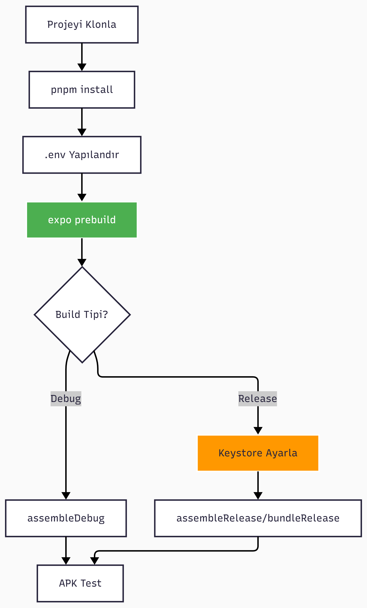

# 🐧 Linux/WSL2 EAS Local Build Rehberi


Bu rehber, **WSL2 Ubuntu** veya **native Linux** üzerinde **EAS Local Build** (`eas build --local`) ile Android APK/AAB oluşturmayı adım adım anlatır.

## 📊 Build Yöntemleri Karşılaştırması

| Özellik                  | EAS Cloud Build | **WSL2/Linux Local** | Windows Native   |
| ------------------------ | --------------- | -------------------- | ---------------- |
| **Kurulum**              | ✅ Kolay        | ⚠️ Orta             | ⚠️ Orta          |
| **İlk Build Süresi**     | ~15-20 dk       | ~10-15 dk            | ~10-15 dk        |
| **Sonraki Build**        | ~10-15 dk       | ~5-10 dk             | ~5-10 dk         |
| **Maliyet**              | 💰 Ücretli      | ✅ Ücretsiz         | ✅ Ücretsiz      |
| **İnternet Gereksinimi** | ☁️ Gerekli      | 🌐 İsteğe bağlı     | 🌐 İsteğe bağlı  |
| **Disk Kullanımı**       | ✅ Yok          | 📦 ~15 GB           | 📦 ~10 GB        |
| **Platform**             | ✅ Hepsi        | 🐧 Linux/WSL2       | 🪟 Windows       |
| **`eas build --local`**  | N/A             | ✅ Destekleniyor    | ❌ Desteklenmiyor |

**Alternatif Rehberler:**

- 📦 [Mobile Ana Dokümantasyon / Cloud Build](../apps/mobile/README.md) - En kolay yöntem
- 🪟 [Windows Native Build](./mobile-local-build-windows-native.md) - Gradle ile doğrudan build

---

## 📋 Sistem Gereksinimleri

| Bileşen         | Versiyon      | Neden Gerekli             | Disk Alanı |
| --------------- | ------------- | ------------------------- | ---------- |
| **WSL2**        | Ubuntu 22.04+ | Linux environment         | ~2-3 GB    |
| **Node.js**     | 20.x LTS      | JavaScript runtime        | ~500 MB    |
| **pnpm**        | 9.x           | Monorepo paket yöneticisi | ~50 MB     |
| **Java JDK**    | 17            | Android Gradle build      | ~300 MB    |
| **Android SDK** | 36            | Platform ve build tools   | ~8-10 GB   |
| **EAS CLI**     | Latest        | Expo build aracı          | ~50 MB     |

## 🚀 Adım Adım Kurulum
### 1- WSL2 Kurulumu ve Hazırlık
PowerShell (Yönetici) ile WSL kurun, ardından açılan Ubuntu terminalinde sistemi güncelleyin:
```powershell
# WSL ve Ubuntu kurulumu
wsl --install -d Ubuntu-22.04
# WSL versiyonunu kontrol et (2 olmalı)
wsl --list --verbose
```
Ubuntu terminali açıldığında:
```bash
# Paket listeleri ve paketleri güncelle
sudo apt update && sudo apt upgrade -y
```

---
### 2- Temel Bağımlılıkları Kur
```bash
# Build araçları ve yardımcı programlar
sudo apt install -y curl wget unzip zip git build-essential
```
**Yüklenen Araçlar:**
| Araç              | Açıklama             |
| ----------------- | -------------------- |
| `curl`            | URL'den veri indirme |
| `wget`            | Dosya indirme        |
| `unzip/zip`       | Arşiv işlemleri      |
| `git`             | Versiyon kontrolü    |
| `build-essential` | GCC, make vb.        |
---

### 3- Java JDK 17 Kurulumu
Android build sistemi Java 17 gerektirir.
```bash
# OpenJDK 17 kurulumu
sudo apt install -y openjdk-17-jdk
# Versiyonu doğrulama
java -version
```
**Beklenen Çıktı:**
```
openjdk version "17.0.x" 2024-xx-xx
OpenJDK Runtime Environment (build 17.0.x+x-Ubuntu-xxx)
OpenJDK 64-Bit Server VM (build 17.0.x+x-Ubuntu-xxx, mixed mode, sharing)
```
> [!TIP]
> Birden fazla Java versiyonu varsa `sudo update-alternatives --config java` ile 17'yi seçebilirsiniz.

---

### 4- Node.js Kurulumu (nvm ile)
**nvm** (Node Version Manager) ile kolay versiyon yönetimi:
```bash
# nvm'i indir ve kur
curl -o- https://raw.githubusercontent.com/nvm-sh/nvm/v0.40.1/install.sh | bash

# Shell'i yeniden yükle
source ~/.bashrc

# Node.js 20 LTS kur ve varsayılan olarak ayarla
nvm install 20
nvm use 20
nvm alias default 20
```
**Doğrulama:**
```bash
node -v  # v20.x.x
npm -v   # 10.x.x
```
> [!WARNING]
> `command not found: nvm` hatası alırsanız terminali kapatıp tekrar açın.

---

### 5- PNPM Kurulumu

Bu projede monorepo yapısında olduğu için **pnpm** kullanılıyor.

```bash
# pnpm'i global olarak kur
npm install -g pnpm

# Doğrula
pnpm -v
```
---

### 6- Android SDK Kurulumu
Android Studio kurmadan, yalnızca command-line tools ile SDK kurulumu: (Android 36 için)
#### 6.1 SDK Dizinini Oluştur
```bash
mkdir -p ~/android-sdk/cmdline-tools
cd ~/android-sdk/cmdline-tools
```
#### 6.2 Command Line Tools İndir
```bash
# En güncel sürümü indir (2024)
wget https://dl.google.com/android/repository/commandlinetools-linux-14742923_latest.zip -O cmdline-tools.zip

# Arşivi aç
unzip cmdline-tools.zip

# Dizin yapısını düzenle
mv cmdline-tools latest

# Zip dosyasını temizle
rm cmdline-tools.zip

# SDK Manager ile kendisini ve paketleri güncelle
sdkmanager --update
```
**Oluşan Dizin Yapısı:**
```
~/android-sdk/
└── cmdline-tools/
    └── latest/
        ├── bin/
        │   ├── sdkmanager
        │   └── avdmanager
        └── lib/
```

#### 6.3 Ortam Değişkenlerini Ayarla
```bash
# Düzenleme için nano veya vim kullanılabilir
nano ~/.bashrc
```
Şu satırları dosyanın **sonuna** ekleyin:
```bash
# ============================================
# Android SDK Configuration
# ============================================
export ANDROID_HOME=$HOME/android-sdk
export ANDROID_SDK_ROOT=$HOME/android-sdk
export PATH=$PATH:$ANDROID_HOME/cmdline-tools/latest/bin
export PATH=$PATH:$ANDROID_HOME/platform-tools
export PATH=$PATH:$ANDROID_HOME/build-tools/36.0.0

# ============================================
# Java Configuration
# ============================================
export JAVA_HOME=/usr/lib/jvm/java-17-openjdk-amd64
export PATH=$PATH:$JAVA_HOME/bin
```
**Doğrulama:**
```bash
source ~/.bashrc
echo $ANDROID_HOME  # ~/android-sdk
echo $JAVA_HOME     # /usr/lib/jvm/java-17-openjdk-amd64
```

#### 6.4 SDK Bileşenlerini Kur
```bash
# Lisansları kabul et (y yazıp Enter'a basın)
yes | sdkmanager --licenses
# Gerekli paketleri kur
sdkmanager "platform-tools"
sdkmanager "platforms;android-36"
sdkmanager "build-tools;36.0.0"
sdkmanager "ndk;26.1.10909125"
```
---

### 7- EAS CLI Kurulumu
```bash
# EAS CLI'yi global olarak kur
npm install -g eas-cli

# Expo hesabına giriş yap
eas login
```
**Login Süreci:**
```
? Email or username: your@email.com
? Password: ********
✔ Logged in
```
---

## ✅ Kurulum Doğrulama

Tüm araçların doğru kurulduğunu kontrol edin:

```bash
echo "=========================================="
echo "        🔍 KURULUM DURUMU KONTROLÜ        "
echo "=========================================="
echo ""
echo "📦 Node.js:     $(node -v)"
echo "📦 npm:         $(npm -v)"
echo "📦 pnpm:        $(pnpm -v)"
echo "☕ Java:        $(java -version 2>&1 | head -1)"
echo "🤖 sdkmanager:  $(sdkmanager --version)"
echo "🚀 EAS CLI:     $(eas --version)"
echo ""
echo "📁 ANDROID_HOME: $ANDROID_HOME"
echo "📁 JAVA_HOME:    $JAVA_HOME"
echo "=========================================="
```
**Beklenen Çıktı:**

```
==========================================
        🔍 KURULUM DURUMU KONTROLÜ
==========================================

📦 Node.js:     v20.x.x
📦 npm:         10.x.x
📦 pnpm:        9.x.x
☕ Java:        openjdk version "17.0.x" ...
🤖 sdkmanager:  20.0
🚀 EAS CLI:     eas-cli/x.x.x
📁 ANDROID_HOME: /home/user/android-sdk
📁 JAVA_HOME:    /usr/lib/jvm/java-17-openjdk-amd64
==========================================
```
> [!WARNING]
> Herhangi bir değer boşsa veya hata veriyorsa, ilgili kurulum adımını tekrar kontrol edin.
---

## 📱 Build Alma Süreci

### Workflow Diyagramı

---

### 1- Projeyi Klonla

```bash
cd ~
git clone https://github.com/Besin-Denetle-App/Besin-Denetle.git
cd Besin-Denetle
```
### 2- Bağımlılıkları Yükle
```bash
# Root dizininde monorepo bağımlılıklarını yükle
pnpm install
```
**Çıktı:**
```
Packages: +xxxx
++++++++++++++++++++++++++++++++++++++++++++
Progress: resolved xxxx, reused xxxx, downloaded xx, added xxxx, done
```

### 3- Environment Konfigürasyonu
#### 📋 Kapsamlı Env Kaynağı Tablosu
```
┌─────────────────┬─────────────────┬────────────────────────────┐
│ Senaryo         │ Env Kaynağı     │ API Değişkenleri           │
├─────────────────┼─────────────────┼────────────────────────────┤
│ expo start      │ .env dosyası    │ DEV_API_HOST:DEV_API_PORT  │
│ local preview   │ eas.json        │ API_URL                    │
│ local prod      │ eas.json        │ API_URL                    │
│ cloud preview   │ eas.json        │ API_HOST:API_PORT          │
│ cloud prod      │ EAS Secrets     │ API_URL                    │
└─────────────────┴─────────────────┴────────────────────────────┘
```
#### Development (.env dosyası)
```bash
# Sadece expo start için kullanılır
cp apps/mobile/.env.example apps/mobile/.env
nano apps/mobile/.env
```
#### Preview/Production (eas.json)
Local build için değişkenler `apps/mobile/eas.json` dosyasındaki `env` bloğunda tanımlıdır:
```json
{
  "build": {
    "preview": {
      "env": {
        "APP_ENV": "preview",
        "API_URL": "https://besindenetle.furkanpasa.com/"
      }
    },
    "production": {
      "env": {
        "APP_ENV": "production",
        "API_URL": "https://besindenetle.furkanpasa.com/"
      }
    }
  }
}
```
> [!IMPORTANT]
> **Local build için:** `.env` dosyası okunmaz. Değişkenler `eas.json`'dan gelir.

### 4- Expo Bağımlılıklarını Düzelt
```bash
cd apps/mobile

# Expo SDK ile uyumlu olmayan paketleri otomatik düzelt
npx expo install --fix
```
> [!TIP]
> Bu komut, Expo SDK versiyonuyla uyumsuz paketleri tespit edip doğru versiyonlarına günceller.

### 5- İmzalama ve Credentials
Eğer `codepush` veya `google-signin` gibi özelliklerin çalışmasını istiyorsanız, `eas build --local` komutu için yerel bir keystore yapılandırması gerekir.

Aksi takdirde build işlemi varsayılan debug keystore ile imzalanır ve bazı servisler çalışmaz.

👉 **Kurulum Detayları:** [İmzalama ve Credentials Kurulumu](../apps/mobile/README.md#imzalama-ve-credentials)

### 6- Build Al

#### Development APK (Geliştirme)

```bash
eas build --local --platform android --profile development
```

#### Preview APK (Test)
```bash
eas build --local --platform android --profile preview
```

#### Production AAB (Play Store)
```bash
eas build --local --platform android --profile production
```

**Build Süreci:**
```
✔ Using profile: development
✔ Resolved build type: development
✔ Project configured for EAS Build
✔ Build started
...
⠋ Building (this may take a while)...
Build completed!
📦 Build artifact: app-development.apk
```
> [!NOTE]
> **İlk build ne kadar sürer?**
>
> - ⏱️ İlk build: ~10-30 dakika (Gradle bağımlılıkları indirilir)
> - ⚡ Sonraki build'ler: ~5-15 dakika (cache kullanılır)
---

### APK/AAB Dosya Konumu
Build tamamlandığında dosya `apps/mobile` dizininde oluşur:
```
apps/mobile/
├── build-xxxxxxxx.apk   # Development/Preview APK
└── build-xxxxxxxx.aab   # Production AAB
```
---

## 🔧 Troubleshooting

### Yaygın Hatalar ve Çözümleri

#### 1. SDK Bulunamıyor Hatası

**Hata:**
```
SDK location not found. Define location with an ANDROID_HOME environment variable
```
**Çözüm:**
```bash
# ANDROID_HOME değişkenini kontrol et
echo $ANDROID_HOME

# Boşsa .bashrc'yi tekrar source et
source ~/.bashrc

# Hâlâ boşsa terminali tamamen kapat ve yeniden aç
```
---

#### 2. JAVA_HOME Bulunamıyor
**Hata:**
```
ERROR: JAVA_HOME is not set and no 'java' command could be found
```
**Çözüm:**
```bash
# Java yolunu bul
which java
# /usr/lib/jvm/java-17-openjdk-amd64/bin/java

# JAVA_HOME'u kontrol et
echo $JAVA_HOME

# Manuel olarak ayarla (geçici)
export JAVA_HOME=/usr/lib/jvm/java-17-openjdk-amd64
```

---

#### 3. Yetki Hatası (Permission Denied)
**Hata:**
```
Permission denied: ~/.android-sdk/...
```
**Çözüm:**
```bash
# SDK dizinine yazma yetkisi ver
chmod -R 755 ~/android-sdk

# Veya ownership değiştir
sudo chown -R $USER:$USER ~/android-sdk
```
---

#### 4. WSL2 Bellek Yetersiz
**Hata:**
```
FATAL ERROR: Reached heap limit Allocation failed - JavaScript heap out of memory
```
**Çözüm:**
Windows'ta `%USERPROFILE%\.wslconfig` dosyası oluştur:
```ini
[wsl2]
memory=8GB
swap=4GB
processors=4
```
Sonra WSL'i yeniden başlat:
```powershell
# PowerShell'de
wsl --shutdown
```
> [!TIP]
> Minimum 8 GB RAM ayırmanız önerilir. 16 GB varsa `memory=12GB` yapabilirsiniz.

---
#### 5. Gradle Timeout / Build Hatası
**Hata:**
```
Could not resolve all dependencies for configuration ':app:releaseRuntimeClasspath'
```
**Çözüm:**
```bash
# Gradle cache temizle
rm -rf ~/.gradle/caches

# Node modules temizle ve yeniden yükle
cd ~/Besin-Denetle
rm -rf node_modules
pnpm install

# Build'i tekrar dene
cd apps/mobile
eas build --local --platform android --profile development
```
---

#### 6. sdkmanager Komutu Bulunamıyor
**Hata:**
```
bash: sdkmanager: command not found
```
**Çözüm:**
```bash
# PATH'i kontrol et
echo $PATH | grep android-sdk

# Manuel olarak çalıştır
~/android-sdk/cmdline-tools/latest/bin/sdkmanager --version

# .bashrc'deki PATH ayarlarını kontrol et
cat ~/.bashrc | grep android
```
---

#### 7. NDK Bulunamıyor
**Hata:**
```
NDK not configured. Download it with SDK manager.
```
**Çözüm:**
```bash
# NDK'yı kur
sdkmanager "ndk;26.1.10909125"

# Kurulu NDK'ları listele
sdkmanager --list | grep ndk
```
---

## ❓ Sıkça Sorulan Sorular (SSS)

### Build Süreci

<details>
<summary><strong>Q: Preview vs Production farkı nedir?</strong></summary>

**A:**

| Profil          | Çıktı | İmza        | Kullanım               |
| --------------- | ----- | ----------- | ---------------------- |
| **development** | APK   | Debug key   | Geliştirme, hot reload |
| **preview**     | APK   | EAS managed | Beta test, internal    |
| **production**  | AAB   | Upload key  | Play Store yayını      |

</details>

<details>
<summary><strong>Q: Build her seferinde dependencies indiriyor?</strong></summary>

**A:** Hayır, Gradle cache sistemi kullanır:

- 📦 İlk build: Tüm bağımlılıklar indirilir
- ⚡ Sonraki build'ler: Cache'den kullanılır

Cache'i temizlemek için:

```bash
rm -rf ~/.gradle/caches
```

</details>

---

### WSL2 Spesifik

<details>
<summary><strong>Q: WSL2'den Windows'taki projeye erişebilir miyim?</strong></summary>

**A:** Evet, ama performans düşük olabilir:

```bash
# Windows dosyalarına erişim
cd /mnt/c/Users/username/projects/Besin-Denetle

# ÖNERİLEN: Projeyi WSL içine klonlayın
cd ~
git clone ...
```

> WSL içindeki dosyalar (`~/`) çok daha hızlı işlenir.

</details>

<details>
<summary><strong>Q: WSL2 ile fiziksel cihaza APK yükleyebilir miyim?</strong></summary>

**A:** Doğrudan adb ile zor, ama şu yöntemler var:

1. **APK'yı Windows'a kopyala:**

   ```bash
   cp build-xxx.apk /mnt/c/Users/username/Desktop/
   ```

2. **Windows'tan adb ile yükle:**

   ```powershell
   adb install C:\Users\username\Desktop\build-xxx.apk
   ```

3. **APK'yı cihaza gönder (email, Drive, vs.)**
</details>

---

## 📊 Build Profilleri

`apps/mobile/eas.json` dosyasındaki profiller:

| Profil        | Açıklama                       | Çıktı | İmza        |
| ------------- | ------------------------------ | ----- | ----------- |
| `development` | Geliştirme modu, Expo Go tarzı | APK   | Debug       |
| `preview`     | Test dağıtımı                  | APK   | EAS Managed |
| `production`  | Play Store yayını              | AAB   | Upload Key  |

```bash
# Tüm profilleri görmek için
cat apps/mobile/eas.json
```

---

## 📚 Faydalı Komutlar Referansı

### EAS Komutları

| Komut                                            | Açıklama                     |
| ------------------------------------------------ | ---------------------------- |
| `eas login`                                      | EAS hesabına giriş           |
| `eas build --local -p android`                   | Local Android build          |
| `eas build --local -p android --profile preview` | Preview profili ile build    |
| `eas build:list`                                 | Önceki build'leri listele    |
| `eas credentials`                                | Signing credentials yönetimi |
| `eas whoami`                                     | Giriş yapılan hesabı göster  |

### SDK Manager Komutları

| Komut                               | Açıklama                 |
| ----------------------------------- | ------------------------ |
| `sdkmanager --list`                 | Tüm paketleri listele    |
| `sdkmanager --list_installed`       | Kurulu paketleri listele |
| `sdkmanager "platforms;android-36"` | Android 36 platform kur  |
| `sdkmanager --update`               | Paketleri güncelle       |
| `sdkmanager --licenses`             | Lisansları kabul et      |

### pnpm Komutları

| Komut                        | Açıklama                 |
| ---------------------------- | ------------------------ |
| `pnpm install`               | Bağımlılıkları yükle     |
| `pnpm -F mobile start`       | Mobile uygulamayı başlat |
| `pnpm -F mobile run android` | Android'de çalıştır      |
| `pnpm -F mobile clean`       | Tüm build cache temizle  |

---

## 🔗 İlgili Kaynaklar

### Resmi Dokümantasyon

- [Expo EAS Build](https://docs.expo.dev/build/introduction/)
- [EAS Local Builds](https://docs.expo.dev/build-reference/local-builds/)
- [Android SDK Command Line Tools](https://developer.android.com/tools)
- [WSL2 Kurulum Rehberi](https://docs.microsoft.com/en-us/windows/wsl/install)

### Proje Dökümanları

- 📦 [EAS Cloud Build Rehberi](../apps/mobile/README.md)
- 🪟 [Windows Native Build Rehberi](./mobile-local-build-windows-native.md)
- 🐳 [Docker Development Rehberi](./docker-development.md)
- 🚀 [Server Ubuntu Deployment](./server-deployment.md)

---
